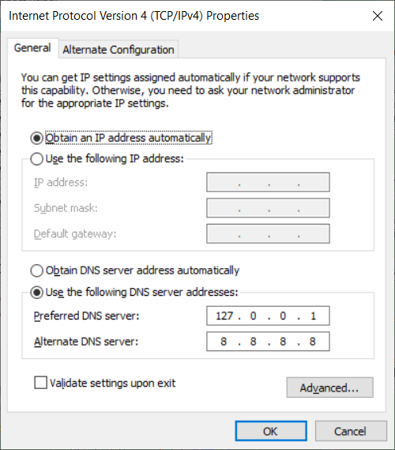

# Automatic DNS Resolution

In order to allow automatic DNS resolution using the provided dnsmasq service we will need to make sure DNS request are routed through our local network.
This requires some configuration.

## Configuration per network

### Mac

On Mac OS, DNS resolution is configured automatically for `*.test` domains using a feature Mac OS inherits from BSD. When `den install` is run (or `den svc up` for the first time) the following contents are placed in the `/etc/resolver/test` file. This has the effect of having zero impact on DNS queries except for those under the `.test` TLD.

```
nameserver 127.0.0.1
```

If you desire to have more than this route through the `dnsmasq` container, you could place another similar file in the `/etc/resolver/` directory on a per-TLD basis, or alternatively configure all DNS lookups to pass through the `dnsmasq` container. To do this, open up Advanced connection settings for the WiFi/LAN settings in System Preferences, and go to the DNS tab. In here press the "+" button to add a new DNS record with the following IP address: `127.0.0.1` followed by fallback records:

```text
127.0.0.1
1.1.1.1
1.0.0.1
```

### systemd-resolved

This approach works on most modern (systemd based) operating systems.

`systemd-resolved` can be configured to forward the requests of `.test` TLD to another DNS server. The configuration file is typically located at `/etc/systemd/resolved.conf` and `/etc/systemd/resolved.conf.d/*.conf`. Run the following commands to configure systemd-resolved:

    sudo mkdir -p /etc/systemd/resolved.conf.d
    echo -e "[Resolve]\nDNS=127.0.0.1\nDomains=~test\n" \
      | sudo tee /etc/systemd/resolved.conf.d/den.conf > /dev/null
    sudo systemctl restart systemd-resolved

### Ubuntu resolvconf

Use the `resolvconf` service to add a permanent entry in your `/etc/resolv.conf` file.

Install resolvconf

```bash
sudo apt update && sudo apt install resolvconf
```

Edit the `/etc/resolvconf/resolv.conf.d/base` file as follows:

```text
search home net
nameserver 127.0.0.1
nameserver 1.1.1.1
nameserver 1.0.0.1
```

Restart network-manager

```bash
sudo service network-manager restart
```

```{note}
    In the above examples you can replace ``1.1.1.1`` and ``1.0.0.1`` (CloudFlare) with the IP of your own preferred DNS resolution service such as ``8.8.8.8`` and ``8.8.4.4`` (Google) or ``9.9.9.9`` and ``149.112.112.112`` (Quad9)
```

### Windows

Add the local dnsmasq resolver as the first DNS server:


